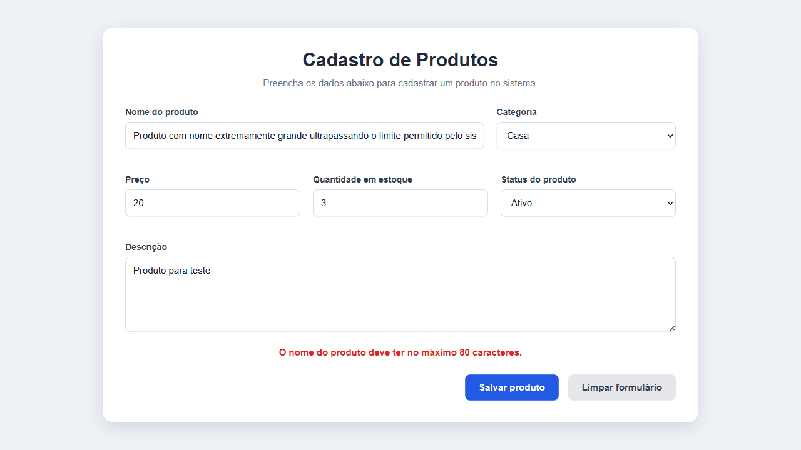
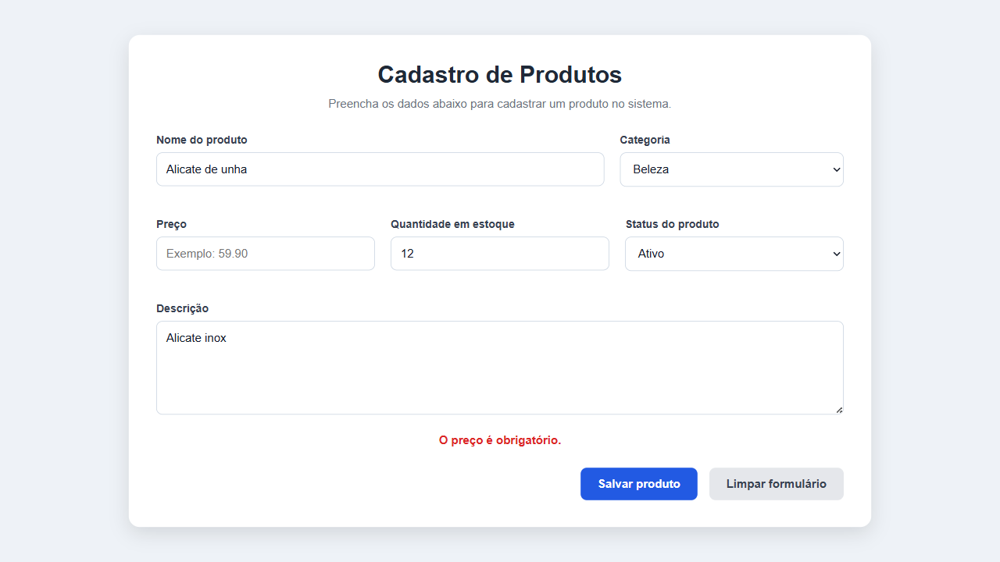
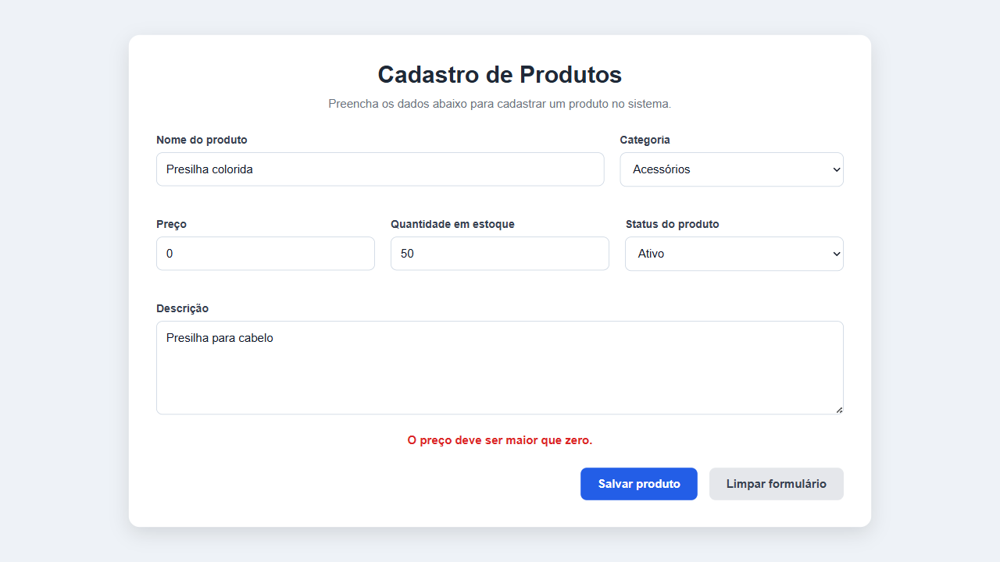
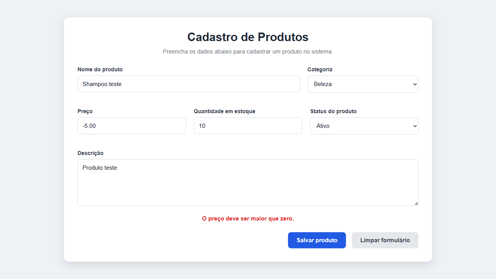
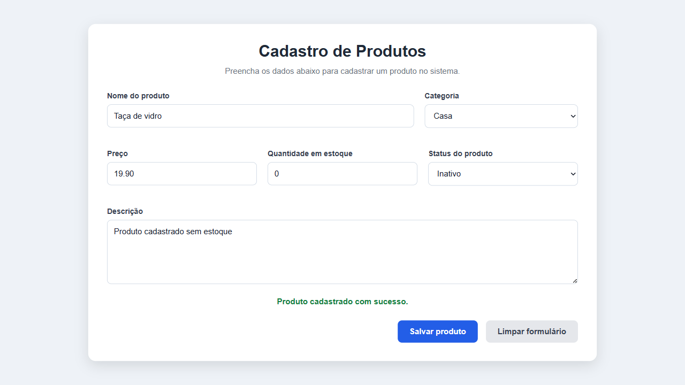
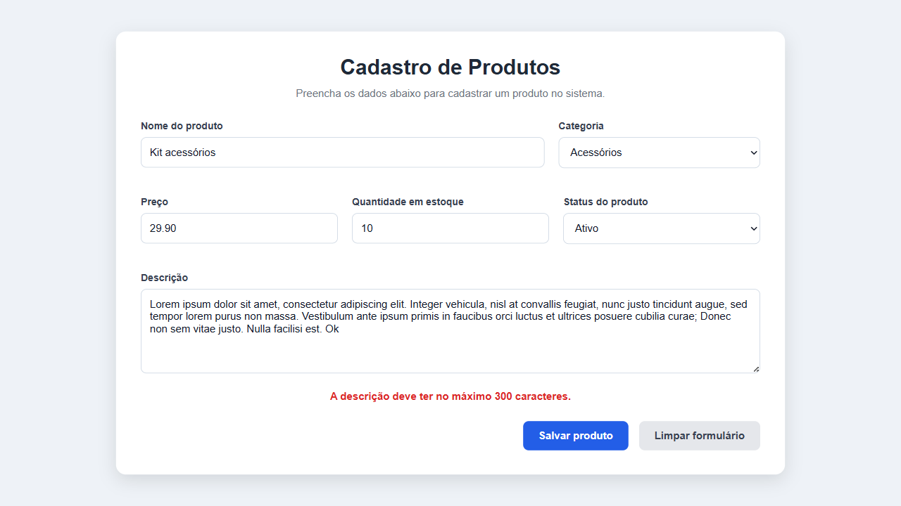
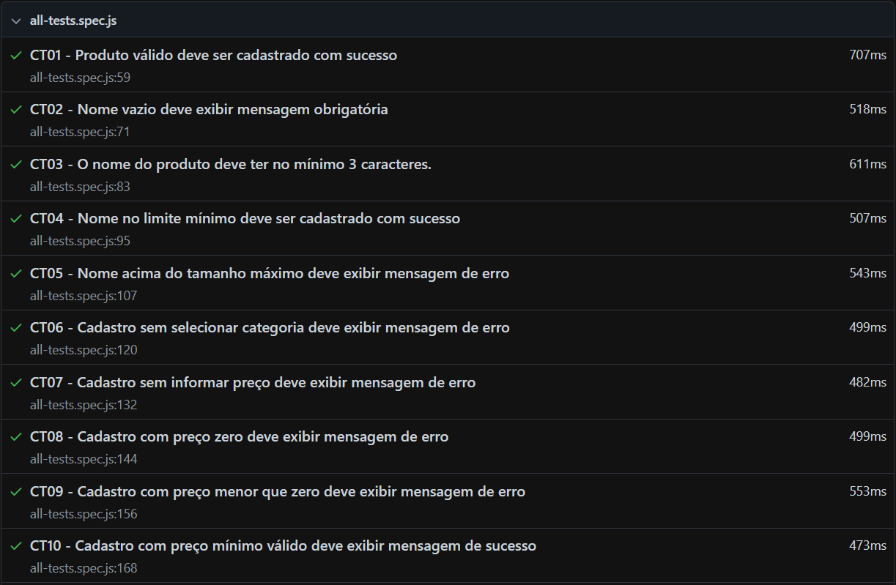
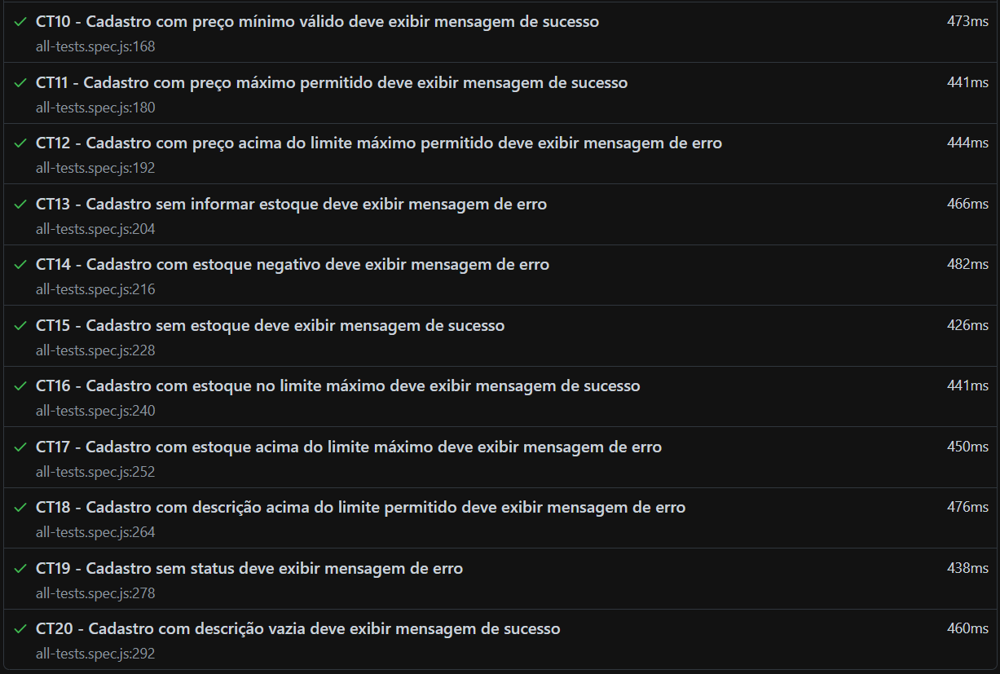

# Parte 1: Plano de teste

| Item | Resposta |
|---|---|
| Nome do sistema | Sistema de Cadastro de Produtos |
| Funcionalidade testada | Cadastro de produtos |
| Tipo de teste | Funcional, caixa-preta, manual e automatizado |
| Técnicas aplicadas | Particionamento de equivalência e análise de valor limite |
| Ferramenta de automação | Playwright |
| Qualificação | Qualidade e Testes de Software - Atividade Prática de Cadastro de Produtos |
| Navegador utilizado | Chromium |
| Ambiente | Windows, VS Code, Node.js, Live Server e Playwright |
| Responsáveis | Mauro do Prado Santos e Jonatas Filipe |
| Data da execução | 22/05/2026 |
| Objetivo do teste | Verificar se o cadastro de produtos atende às regras de negócio |
| Critério de aprovação | O sistema deve apresentar o resultado esperado em todos os cenários obrigatórios |
| Critério de reprovação | Qualquer divergência entre o resultado esperado e o resultado obtido |

# Parte 2: Casos de teste manuais obrigatórios

## CT01: Cadastro com todos os dados válidos

| Campo | Informação |
| --- | --- |
| ID | CT01 |
| Técnica aplicada | Caixa-preta |
| Cenário | Cadastro com todos os dados válidos |
| Nome | Mouse sem fio |
| Categoria | Eletrônicos |
| Preço | 59.90 |
| Quantidade | 10 |
| Descrição | Mouse sem fio com conexão USB |
| Status | Ativo |
| Resultado esperado | Produto cadastrado com sucesso. |
| Resultado obtido | Produto cadastrado com sucesso. |
| Status | Aprovado |

## CT02: Cadastro sem nome do produto

| Campo | Informação |
| --- | --- |
| ID | CT02 |
| Técnica aplicada | Particionamento de equivalência |
| Cenário | Cadastro sem nome do produto |
| Nome | vazio |
| Categoria | Eletrônicos |
| Preço | 59.90 |
| Quantidade | 10 |
| Descrição | Produto para teste |
| Status | Ativo |
| Resultado esperado | O nome do produto é obrigatório |
| Resultado obtido | O nome do produto é obrigatório |
| Status | Aprovado |

## CT03: Nome abaixo do tamanho mínimo

| Campo | Informação |
| --- | --- |
| ID | CT03 |
| Técnica aplicada | Análise de valor limite |
| Cenário | Nome abaixo do tamanho mínimo |
| Nome | TV |
| Categoria | Eletrônicos |
| Preço | 900.00 |
| Quantidade | 5 |
| Descrição | Televisor |
| Status | Ativo |
| Resultado esperado | O nome do produto deve ter no mínimo 3 caracteres. |
| Resultado obtido | O nome do produto deve ter no mínimo 3 caracteres. |
| Status | Aprovado |

## CT04: Nome no limite mínimo

| Campo | Informação |
| --- | --- |
| ID | CT04 |
| Técnica aplicada | Análise de valor limite |
| Cenário | Nome no limite mínimo |
| Nome | Fio |
| Categoria | Acessórios |
| Preço | 9.90 |
| Quantidade | 20 |
| Descrição | Fio para teste |
| Status | Ativo |
| Resultado esperado | Produto cadastrado com sucesso. |
| Resultado obtido | Produto cadastrado com sucesso. |
| Status | Aprovado |

## CT05: Nome acima do tamanho máximo

| Campo | Informação |
| --- | --- |
| ID | CT05 |
| Técnica aplicada | Análise de valor limite |
| Cenário | Nome acima do tamanho máximo |
| Nome | Produto com nome extremamente grande ultrapassando o limite permitido pelo sistema de cadastro |
| Categoria | Casa |
| Preço | 20.00 |
| Quantidade | 3 |
| Descrição | Produto para teste |
| Status | Ativo |
| Resultado esperado | O nome do produto deve ter no máximo 80 caracteres. |
| Resultado obtido | O nome do produto deve ter no máximo 80 caracteres. |
| Status | Aprovado |

## CT06: Cadastro sem selecionar categoria

| Campo | Informação |
| --- | --- |
| ID | CT06 |
| Técnica aplicada | Particionamento de equivalência |
| Cenário | Cadastro sem selecionar categoria |
| Nome | Escova de cabelo |
| Categoria | não selecionada |
| Preço | 15.90 |
| Quantidade | 8 |
| Descrição | Escova simples |
| Status | Ativo |
| Resultado esperado | A categoria é obrigatória. |
| Resultado obtido | A categoria é obrigatória. |
| Status | Aprovado |

## CT07: Cadastro sem informar preço

| Campo | Informação |
| --- | --- |
| ID | CT07 |
| Técnica aplicada | Particionamento de equivalência |
| Cenário | Cadastro sem informar preço |
| Nome | Alicate de unha |
| Categoria | Beleza |
| Preço | vazio |
| Quantidade | 12 |
| Descrição | Alicate inox |
| Status | Ativo |
| Resultado esperado | O preço é obrigatório. |
| Resultado obtido | O preço é obrigatório. |
| Status | Aprovado |

## CT08: Preço no limite inválido zero

| Campo | Informação |
| --- | --- |
| ID | CT08 |
| Técnica aplicada | Análise de valor limite |
| Cenário | Preço no limite inválido zero |
| Nome | Presilha colorida |
| Categoria | Acessórios |
| Preço | 0 |
| Quantidade | 50 |
| Descrição | Presilha para cabelo |
| Status | Ativo |
| Resultado esperado | O preço deve ser maior que zero. |
| Resultado obtido | O preço deve ser maior que zero. |
| Status | Aprovado |

## CT09: Preço menor que zero

| Campo | Informação |
| --- | --- |
| ID | CT09 |
| Técnica aplicada | Particionamento de equivalência |
| Cenário | Preço menor que zero |
| Nome | Shampoo teste |
| Categoria | Beleza |
| Preço | -5.00 |
| Quantidade | 10 |
| Descrição | Produto teste |
| Status | Ativo |
| Resultado esperado | O preço deve ser maior que zero. |
| Resultado obtido | O preço deve ser maior que zero. |
| Status | Aprovado |

## CT10: Preço mínimo válido

| Campo | Informação |
| --- | --- |
| ID | CT10 |
| Técnica aplicada | Análise de valor limite |
| Cenário | Preço mínimo válido |
| Nome | Elástico de cabelo |
| Categoria | Acessórios |
| Preço | 0.01 |
| Quantidade | 100 |
| Descrição | Elástico simples |
| Status | Ativo |
| Resultado esperado | Produto cadastrado com sucesso. |
| Resultado obtido | Produto cadastrado com sucesso. |
| Status | Aprovado |

## CT11: Preço no limite máximo permitido

| Campo | Informação |
| --- | --- |
| ID | CT11 |
| Técnica aplicada | Análise de valor limite |
| Cenário | Preço no limite máximo permitido |
| Nome | Notebook Gamer |
| Categoria | Eletrônicos |
| Preço | 9999.99 |
| Quantidade | 2 |
| Descrição | Notebook de alto desempenho |
| Status | Ativo |
| Resultado esperado | Produto cadastrado com sucesso. |
| Resultado obtido | Produto cadastrado com sucesso. |
| Status | Aprovado |

## CT12: Preço acima do máximo permitido

| Campo | Informação |
| --- | --- |
| ID | CT12 |
| Técnica aplicada | Análise de valor limite |
| Cenário | Preço acima do máximo permitido |
| Nome | Computador Premium |
| Categoria | Eletrônicos |
| Preço | 10000.00 |
| Quantidade | 1 |
| Descrição | Computador para teste |
| Status | Ativo |
| Resultado esperado | O preço não pode ser maior que 9999.99. |
| Resultado obtido | O preço não pode ser maior que 9999.99. |
| Status | Aprovado |

## CT13: Cadastro sem informar estoque

| Campo | Informação |
| --- | --- |
| ID | CT13 |
| Técnica aplicada | Particionamento de equivalência |
| Cenário | Cadastro sem informar estoque |
| Nome | Carrinho de brinquedo |
| Categoria | Brinquedos |
| Preço | 25.90 |
| Quantidade | vazio |
| Descrição | Brinquedo infantil |
| Status | Ativo |
| Resultado esperado | A quantidade em estoque é obrigatória. |
| Resultado obtido | A quantidade em estoque é obrigatória. |
| Status | Aprovado |

## CT14: Estoque negativo

| Campo | Informação |
| --- | --- |
| ID | CT14 |
| Técnica aplicada | Análise de valor limite |
| Cenário | Estoque negativo |
| Nome | Copo de vidro |
| Categoria | Casa |
| Preço | 12.50 |
| Quantidade | -1 |
| Descrição | Copo simples |
| Status | Ativo |
| Resultado esperado | A quantidade em estoque não pode ser negativa. |
| Resultado obtido | A quantidade em estoque não pode ser negativa. |
| Status | Aprovado |

## CT15: Produto sem estoque, mas permitido

| Campo | Informação |
| --- | --- |
| ID | CT15 |
| Técnica aplicada | Análise de valor limite |
| Cenário | Produto sem estoque, mas permitido |
| Nome | Taça de vidro |
| Categoria | Casa |
| Preço | 19.90 |
| Quantidade | 0 |
| Descrição | Produto cadastrado sem estoque |
| Status | Inativo |
| Resultado esperado | Produto cadastrado com sucesso. |
| Resultado obtido | Produto cadastrado com sucesso. |
| Status | Aprovado |

## CT16: Estoque no limite máximo

| Campo | Informação |
| --- | --- |
| ID | CT16 |
| Técnica aplicada | Análise de valor limite |
| Cenário | Estoque no limite máximo |
| Nome | Presilha coração |
| Categoria | Acessórios |
| Preço | 4.99 |
| Quantidade | 999 |
| Descrição | Presilha pequena |
| Status | Ativo |
| Resultado esperado | Produto cadastrado com sucesso. |
| Resultado obtido | Produto cadastrado com sucesso. |
| Status | Aprovado |

## CT17: Estoque acima do permitido

| Campo | Informação |
| --- | --- |
| ID | CT17 |
| Técnica aplicada | Análise de valor limite |
| Cenário | Estoque acima do permitido |
| Nome | Balança digital |
| Categoria | Eletrônicos |
| Preço | 39.90 |
| Quantidade | 1000 |
| Descrição | Balança portátil |
| Status | Ativo |
| Resultado esperado | A quantidade em estoque não pode ser maior que 999. |
| Resultado obtido | A quantidade em estoque não pode ser maior que 999. |
| Status | Aprovado |

## CT18: Descrição acima do limite

| Campo | Informação |
| --- | --- |
| ID | CT18 |
| Técnica aplicada | Análise de valor limite |
| Cenário | Descrição acima do limite |
| Nome | Kit acessórios |
| Categoria | Acessórios |
| Preço | 29.90 |
| Quantidade | 10 |
| Descrição | Texto com mais de 300 caracteres |
| Status | Ativo |
| Resultado esperado | A descrição deve ter no máximo 300 caracteres. |
| Resultado obtido | A descrição deve ter no máximo 300 caracteres. |
| Status | Aprovado |

## CT19: Cadastro sem status

| Campo | Informação |
| --- | --- |
| ID | CT19 |
| Técnica aplicada | Particionamento de equivalência |
| Cenário | Cadastro sem status |
| Nome | Produto teste status |
| Categoria | Casa |
| Preço | 10.00 |
| Quantidade | 10 |
| Descrição | Produto de teste |
| Status | não selecionado |
| Resultado esperado | O status do produto é obrigatório. |
| Resultado obtido | O status do produto é obrigatório. |
| Status | Aprovado |

## CT20: Cadastro válido com descrição vazia

| Campo | Informação |
| --- | --- |
| ID | CT20 |
| Técnica aplicada | Caixa-preta |
| Cenário | Cadastro válido com descrição vazia |
| Nome | Touca de cetim |
| Categoria | Beleza |
| Preço | 18.90 |
| Quantidade | 30 |
| Descrição | vazio |
| Status | Ativo |
| Resultado esperado | Produto cadastrado com sucesso. |
| Resultado obtido | Produto cadastrado com sucesso. |
| Status | Aprovado |

# Parte 3: Tabela de execução dos testes

| ID | Cenário | Resultado esperado | Resultado obtido | Status |
| --- | --- | --- | --- | --- |
| CT01 | Cadastro com todos os dados válidos | Produto cadastrado com sucesso. | Produto cadastrado com sucesso. | Aprovado |
| CT02 | Cadastro sem nome do produto | O nome do produto é obrigatório | O nome do produto é obrigatório | Aprovado |
| CT03 | Nome abaixo do tamanho mínimo | O nome do produto deve ter no mínimo 3 caracteres. | O nome do produto deve ter no mínimo 3 caracteres. | Aprovado |
| CT04 | Nome no limite mínimo | Produto cadastrado com sucesso. | Produto cadastrado com sucesso. | Aprovado |
| CT05 | Nome acima do tamanho máximo | O nome do produto deve ter no máximo 80 caracteres. | O nome do produto deve ter no máximo 80 caracteres. | Aprovado |
| CT06 | Cadastro sem selecionar categoria | A categoria é obrigatória. | A categoria é obrigatória. | Aprovado |
| CT07 | Cadastro sem informar preço | O preço é obrigatório. | O preço é obrigatório. | Aprovado |
| CT08 | Preço no limite inválido zero | O preço deve ser maior que zero. | O preço deve ser maior que zero. | Aprovado |
| CT09 | Preço menor que zero | O preço deve ser maior que zero. | O preço deve ser maior que zero. | Aprovado |
| CT10 | Preço mínimo válido | Produto cadastrado com sucesso. | Produto cadastrado com sucesso. | Aprovado |
| CT11 | Preço no limite máximo permitido | Produto cadastrado com sucesso. | Produto cadastrado com sucesso. | Aprovado |
| CT12 | Preço acima do máximo permitido | O preço não pode ser maior que 9999.99. | O preço não pode ser maior que 9999.99. | Aprovado |
| CT13 | Cadastro sem informar estoque | A quantidade em estoque é obrigatória. | A quantidade em estoque é obrigatória. | Aprovado |
| CT14 | Estoque negativo | A quantidade em estoque não pode ser negativa. | A quantidade em estoque não pode ser negativa. | Aprovado |
| CT15 | Produto sem estoque, mas permitido | Produto cadastrado com sucesso. | Produto cadastrado com sucesso. | Aprovado |
| CT16 | Estoque no limite máximo | Produto cadastrado com sucesso. | Produto cadastrado com sucesso. | Aprovado |
| CT17 | Estoque acima do permitido | A quantidade em estoque não pode ser maior que 999. | A quantidade em estoque não pode ser maior que 999. | Aprovado |
| CT18 | Descrição acima do limite | A descrição deve ter no máximo 300 caracteres. | A descrição deve ter no máximo 300 caracteres. | Aprovado |
| CT19 | Cadastro sem status | O status do produto é obrigatório. | O status do produto é obrigatório. | Aprovado |
| CT20 | Cadastro válido com descrição vazia | Produto cadastrado com sucesso. | Produto cadastrado com sucesso. | Aprovado |

# Parte 4: Evidências dos testes

As evidências foram geradas automaticamente pelo Playwright ao final de cada caso de teste.

# Parte 5: Registro de defeitos
Não houve nenhum erro/defeito nos testes

# Parte 6: Automação com Playwright
Foi feito teste automatizado de todos os cenários de teste (CT01 a CT20). O código dos testes automatizados está no arquivo local `tests/all-tests.spec.js`.

O arquivo `.spec.js` também está no Github neste link:
https://github.com/omaurosantos/6dsm/blob/main/QualidadeETestesDeSoftware/AULA%2008-05-26/projeto-cadastro-produtos/tests/all-tests.spec.js

# Parte 7: Análise do relatório do Playwright
- Quantos testes foram executados? 20
- Quantos testes passaram? 20
- Quantos testes falharam? 0 
- Algum teste foi ignorado? Não
- Algum teste ficou instável? Não
- Qual teste demorou mais? O primeiro, durou 707ms
- O relatório ajudou a entender os erros encontrados? Não houve erro
- Algum teste automatizado apresentou resultado diferente do teste manual? Não

Print do relatório Playwright:

# Parte 8: Conclusão técnica

Com base nos testes manuais e automatizados executados, o sistema de cadastro de produtos atendeu às regras de negócio avaliadas nos cenários obrigatórios. Foram testados casos válidos, campos obrigatórios, limites mínimos e máximos de nome, preço, estoque, descrição e status do produto.

Todos os 20 casos de teste foram aprovados tanto na execução manual quanto na execução automatizada com Playwright. Não foram encontrados defeitos durante a execução, e os resultados obtidos ficaram de acordo com os resultados esperados. Portanto, a funcionalidade de cadastro de produtos está aprovada para os critérios testados nesta atividade.
